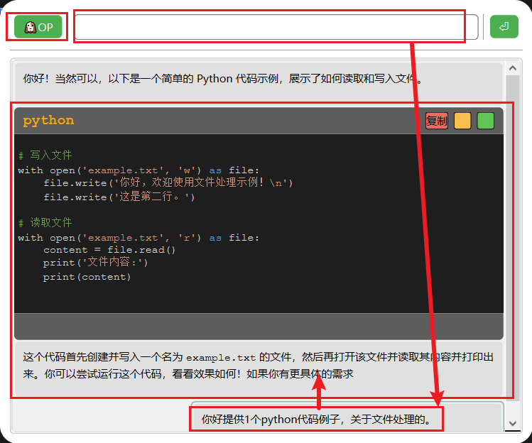
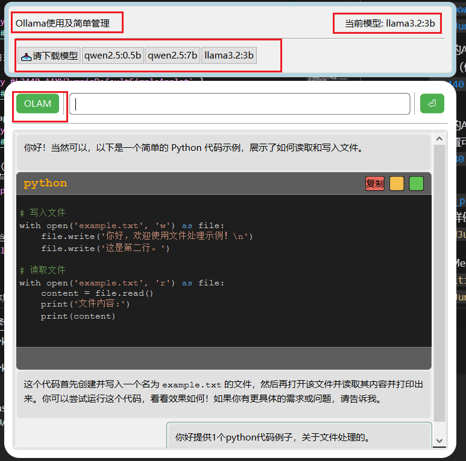
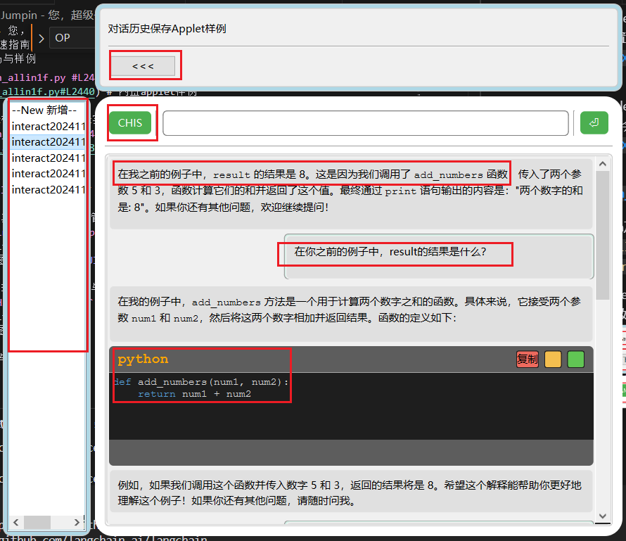

# ANAN Jumpin - 您，超级个体，智效启动

ANAN Jumpin 是一款面向**AI能效达人及超级个体**的PC端AI效率工具与平台；旨在迅速触达AI，一招即用、一切插件、一台Laptop掌控智效，在您本地聚合属于您自己的AI能力；

## 🤔 "我如何用？"
基础使用，进阶使用，定制开发，深度贡献；

### 👨‍💻 “我是，程序小白，就想用AI提效”：
- 启动后使用内置AI对话等功能体验AI；（可全局热键，默认为 `Alt+z`）
- 切换内置Applet功能来使用，常用的AI、Agent或提效应用；
- 获取安装社区插件扩展功能或Applet来使用；
- 提出建议、issue，帮助Jumpin提升；

### 🛠️ “我是，IT、AI能效爱好者，喜欢折腾工具提升自我”：
- 使用内置或扩展的Applet、插件使用他们的AI智效能力加速工作与学习；
- 修改配置文件自定义行为；
- 修改现有插件功能，简单定制自己个性插件；
- 运行学习all in 1 file主干程序，可快速学习体验基于LLM的AI、Agent的程序实现；
- 提出建议、issue，帮助Jumpin提升；

### 🎯 “我是，AI/程序开发者达人”：
- 使用内置或扩展的Applet、插件使用他们的AI智效能力加速工作与学习； 
- 运行学习all in 1 file主干程序，可快速学习体验基于LLM的AI、Agent的程序实现；
- 开发专业AI应用插件，引入新功能或基建资源，并设计定制Applet功能套件
- 集成自有AI模型和工具链，AI基础建设与Jumpin应用建设互相推动闭环提升；
- 分享插件提升收益；
- 插件精化，帮助沉淀至主干程序。

### 🚀 “我是，超级个体”：
- 能够进行“AI/程序开发者达人”对应的所有事项；
- 打造自身领域个性化AI化工作流，极限提效自身，完成10倍效率，拿到原需整个团队的成果；
- 整合各类功能套件，形成某个或多个行业或领域通用，可标准化的Applet应用套件与插件；
- 形成个人AI化效率体系系统，在Jumpin上能进行，知识数据，运作流程，智能体的整体沉淀，方案级甚至方法论成果达成与沉淀；分享与销售推广。

## 🌟 主要特性
- 🔑 **一招即用**: 热键唤起/隐藏，热键切换AI、Applet套件能力；
- 📝 **轻量安全**: 默认本地极致轻量部署，个人数据安全有保障；
- 🚀 **提速学AI**: all in 1 file 代码主干，可快速学习体验LLM为基础的AI、Agent；快速学习扩展插件的开发；
- 🎯 **聚合聚焦**: AI、Agent、多Agent等能力均聚合至Applet直达应用目标；
- 🔌 **一切插件**: 通过插件安装，可以获取需要的所有性能力；
- 🎨 **可高定制**: 支持自定义界面、AI资源、其他工具资源几乎所有模块组件；
- 💬 **其他基础**: 可支持RAG，ai-agent等、流程化多agent等AI平台设施范式，支持OpenAI，Ollama等各类LLM基座框架接入，支持Ollama本地维护。

## 🚀 快速开始

### ⚙️ 快速运行all in 1 file版（非安装） 
安装依赖

```bash
pip install -r requirements.txt
```

配置

1. 创建 `.env` 文件并配置你的OpenAI API密钥（或兼容模型的秘钥）:
```
OPENAI_API_KEY=<your_api_key_here>
OPENAI_BASE_URL=<baseurl,http://xxx/v1>
```
**注意**：.env 内容也可直接设置环境变量，不适用.env文件配置。

2. 运行“all in 1 file”的内置主程序:
```bash
python ananxw_jumpin_allin1f.py
```

### ⚙️ 快速安装运行 

先已得到dist的打包版，将ananxw_jumpin目录解压或按照到任意位置。  
1. 在ananxw_jumpin工作目录，创建 `.env` 文件并配置你的OpenAI API密钥（或兼容模型的秘钥）:
```
OPENAI_API_KEY=<your_api_key_here>
OPENAI_BASE_URL=<baseurl,http://xxx/v1>
```
**注意**：.env 内容也可直接设置环境变量，不适用.env文件配置。

2. 直接双击，ananxw_jumpin.exe文件。

3. 或者在命令行中运行：
```cmd
cd ananxw_jumpin
ananxw_jumpin.exe
```

**打包版获取：**
- 直接下载.zip，或安装包：（待建设... 需要找包存放点）
- 下载工程后，使用pyinstaller 进行打包后，在dist目录下得到。参考：[`📦打包发布版应用包`](#📦打包发布版应用包)


### ⚙️ 快速配置
默认使用环境变量配置或 `.env` 中设置环境变量配置，默认为OpenAI api需要。**可以不做任何其他配置，均会使用默认参数。**

更多配置：
- 命令行配置： 
- 支持文件配置：

### 🛠️ 快速使用
基本操作：
- 使用全局快捷键（默认为 `Alt+z` ）呼出/隐藏主界面
- 在输入框中输入内容与AI对话（默认为通过环境变量或.env配置的LLM接入）
- 已提供系统托盘，可访问更多功能。

Applet切换：  
- 程序支持多个Applet，每个Applet可以提供不同的功能。使用界面左上角Applet切换（或默认快捷键 `Tab`,当前为内置插件实现。）在不同Applet间切换。

如下图为本工具平台基本界面，左上“🐶OP”为切换applet时会有不同的title展示（小程序标题，applet-title）。


## 🔧 开发者快速指南

- 主干程序均在[`ananxw_jumpin_allin1f.py`](ananxw_jumpin_allin1f.py)文件实现。如当前版本迭代后如未及时更新说明，请按照实际代码为准。该除环境变量必须得设定外，可以在任意位置上建立anaxw_jumpin目录，只用该文件启动本工具。其中包含主干框架与最简单的内置插件与Applet，AI-访问程序等。
- 内置插件独立文件[`builtin_plugins.py`](builtin_plugins.py)，该文件为孵化中的内置插件与Applet及样例代码。如运行[`ananxw_jumpin_allin1f.py`](ananxw_jumpin_allin1f.py) 时同目录有[`builtin_plugins.py`](builtin_plugins.py) 会自动加载。 其中包含的插件，见以下样例代码部分说明。  
- 使用pyinstaller进行打包，打包配置脚本 [` ananxw_jumpin_allin1f.spec `](ananxw_jumpin_allin1f.spec) 。


### 📦 主要外部依赖
详细版本请见：[`requirements.txt`](requirements.txt)  
简要说明：
- python 3.9+
- pyside6：界面主要为qt开发；
- pynput：全局快捷键；
- openai-api：AI-LLM对接；
- langchain：AI建设；(langchain版本变更较快，已使用尽量基本功能，如使用其他版本报错，请告知。) 
- chromadb: 向量数据库，(尝试) 实现**知识库**基础建设；（当前在插件中实现）
- pyinstaller: app执行包，打包；

### 📦打包发布版应用包

本应用使用pyinstaller进行解析与打包可独立运行的发布版。 pyinstaller的构建文件为：
[`ananxw_jumpin_allin1f.spec`](ananxw_jumpin_allin1f.spec) 
（其中包含chromadb不分，chromadb可能打包时不稳定，必要时可以移除插件内容与打包内容。chromadb打包时是使用拷贝方式整体拷贝到包内目录，来源为_libs_ext目录中的包。）
开发打包前建议先用conda建立开发环境，然后切换进入环境中安装依赖，并打包：
```cmd
conda activate ananxw
# 如未安装依赖则要执行。
pip install -r requirements.txt 

# 构建打包
pyinstaller --noconfirm ananxw_jumpin_allin1f.spec 
```
打包成功后的独立运行包为，打包时生成的dist目录下的**整个ananx_jumpin目录**。

### 📝 插件开发

1. 在内置插件文件（默认为ananxw_jumpin包下的`builtin_plugins.py`，）中增加插件类。
1. 创建新的插件类继承 `AAXWAbstractPlugin`；
2. 重写必要的接口方法，如：
3. 启动主干程序自动扫描加载并安装插件；

```python
class MyPlugin(AAXWAbstractPlugin):
    @override
    def onInstall(self):
        """
        插件安装时的回调方法
        建议实现:
            - 初始化插件所需的资源
            - 注册插件提供的服务到DI容器（如有必要）
            - 设置插件的配置信息
            - 创建必要的UI组件
        """
        pass

    @override
    def enable(self):
        """
        启用插件功能时的回调方法
        建议实现:
            - 激活插件的功能
            - 显示插件的UI组件
            - 注册事件监听器
            - 启动后台服务
        """
        pass
    @override
    def disable(self):
        """
        禁用插件功能时的回调方法
        建议实现:
            - 停用插件的功能
            - 隐藏插件的UI组件
            - 注销事件监听器
            - 停止后台服务
        """
        pass

        @override
    def onUninstall(self):
        """
        插件卸载时的回调方法
        建议实现:
            - 清理插件创建的资源
            - 从DI容器注销服务
            - 保存配置信息
            - 移除UI组件
        """
        pass
```

- 插件机制支持用户插件目录，默认在程序运行当前目录，其插件默认为plugin_前缀的py文件；**（目录变更或开关用户插件目录加载，需要进行配置或自定义main来完成修改）**

### 📝 Applet开发（插件方式）

1. 继承 `AAXWAbstractApplet` 类；
2. 实现必要的界面和功能逻辑；
3. 关联到某个插件或自定义新的插件；
4. 在插件中获取`AppletManager`并用其`addApplet()`方法加入你的Applet；

### 📝 详细说明以及参考
（建设中...）

### 🔍 示例代码与样例
**注意：如位置变更请直接对应文件中搜索类名**

1. 内置的插件样例，附加输入框的快键键功能等（位置可能会有变化）：   
[`ananxw_jumpin_allin1f.py 中 AAXWJumpinDefaultBuiltinPlugin` ](ananxw_jumpin_allin1f.py) # 内置插件实现样例

2. 内置的Applet样例，1个由插件去加载的简单applet实现~~ollama访问~~ （位置可能会有变化）；
[`ananxw_jumpin_allin1f.py 中 AAXWJumpinDefaultSimpleApplet` ](ananxw_jumpin_allin1f.py) # 内置applet样例

3. 内置的Applet样例，默认applet实现各种默认主要应用功能（位置可能会有变化）；
[`ananxw_jumpin_allin1f.py 中 AAXWJumpinDefaultCompoApplet` ](ananxw_jumpin_allin1f.py#L2827) # 内置applet样例


**注意：当前版本[`builtin_plugins.py`](builtin_plugins.py) 文件样例：**

4. 本地Ollama及其模型使用与基本管理样例，包含插件与applet实现：[`builtin_plugins.py 中 AAXWJumpinOllamaSimpleApplet` ](builtin_plugins.py)
    - Applet-title:"OLAM"；
    - 界面如下图：

5. 本地Memory与历史记录实现样例，包含插件与applet实现：[`builtin_plugins.py #L718 AAXWJumpinChatHistoryExpApplet` ](builtin_plugins.py#L718)
    - Applet-title:"CHIS"
    - 当前使用Langchian的本地文件持久化，在工作目录下，memories目录下保存；
    - 界面如下图：


6. 本地知识库与Rag(chromadb)实现样例，包含插件与applet实现：（本功能在打包版本中可能不稳定，请注意使用。）[`builtin_plugins.py 中 AAXWJumpinKBSApplet` ](builtin_plugins.py)
    - Applet-title:"KBS"
    - chromadb实现vectordb能力，可上传小尺寸pdf，作为LLM反馈时的搜索查询来源。
    - 在工作目录下会生成 chroma_db,kbs_store来保存知识文档与索引数据。

## 📝 版本历史与计划
- v0.7: 增加：
    - 已增加基本向量数据库（基于chroma 0.5.23实现），支持形成基本rag能力；并提供例子
    - 已完成 打包与发布版初步建设；且支持chroma 0.5.23版本；
- v0.6: 已增加
    - builtin_plugins.py 用于孵化的独立内置插件与applet样例；
    - 本地Ollama模型使用与简单管理功能；
    - 通用工具消息面板（上或下），附加展示功能面板（左或右）；
    - chat history（memory）与多轮对话功能，提示词模版功能；并提供例子；
- v0.5: 已增加可切换Applet功能，完善插件框架与机制；
- v0.4: 已增加工作目录配置，日志功能，简易注入框架；
- v0.3: 已增加Markdown展示气泡；
- v0.2: 已增加托盘功能，支持全局热键。

### 🌈 计划与路线概要

v0.8+ 计划  
- 代码块需支持plaintext/unknown 以及其他结构，未知，平文为全白。
- 提升一轮基本功能健壮性，误操作容错兼容。
- 提供其他ai相关集成样例，如：chateveredit，xbrain等
- coze集成对接应用样例；
- dify集成对接样例；
- 可集成密塔等搜索（可插件方式）
- 支持可能轻量级，流程式agent/多agent
- 轻量级meta agent；


## 🤝 贡献

欢迎提交Issue；  
欢迎联系，沟通交流。

## 📄 许可证

 ananxw_jumpin(ANAN Jumpin，安安将品) is open source and licensed under [Apache 2.0](LICENSE)

## Disclaimer
This software is provided without any warranty. The developers and the associated organization are not responsible for any issues that may arise from the use of this software. Please refer to the LICENSE file for the full legal text.

## 👨‍💻 作者

小王同学 wfeng007 (wfeng007@163.com) 邮件不常看，可B站找:中文昵称+009

